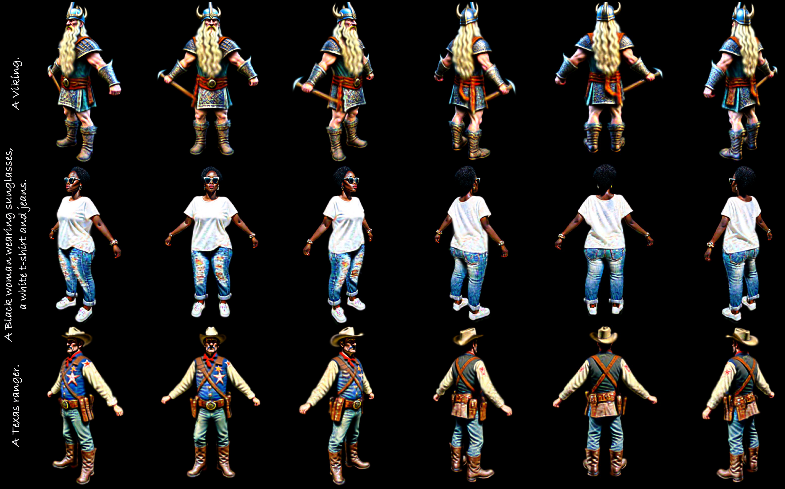

# HumanGaussian: Text-Driven 3D Human Generation with Gaussian Splatting

[Xian Liu](https://alvinliu0.github.io/)<sup>1</sup>, [Xiaohang Zhan](https://xiaohangzhan.github.io/)<sup>2</sup>, [Jiaxiang Tang](https://me.kiui.moe/)<sup>3</sup>, [Ying Shan](https://scholar.google.com/citations?user=4oXBp9UAAAAJ)<sup>2</sup>, [Gang Zeng](https://scholar.google.com/citations?user=RuHyY6gAAAAJ)<sup>3</sup>,   
[Dahua Lin](http://dahua.site/)<sup>1</sup>, [Xihui Liu](https://xh-liu.github.io/)<sup>4</sup>, [Ziwei Liu](https://liuziwei7.github.io/)<sup>5</sup>.  
<sup>1</sup>CUHK&nbsp;&nbsp;&nbsp;&nbsp;&nbsp;<sup>2</sup>Tencent AI Lab&nbsp;&nbsp;&nbsp;&nbsp;&nbsp;<sup>3</sup>PKU&nbsp;&nbsp;&nbsp;&nbsp;&nbsp;<sup>4</sup>HKU&nbsp;&nbsp;&nbsp;&nbsp;&nbsp;<sup>5</sup>NTU  

### [Project](https://alvinliu0.github.io/projects/HumanGaussian) | [Paper](https://alvinliu0.github.io/projects/HumanGaussian/humangaussian.pdf) | [arXiv](https://arxiv.org/abs/2311.17061) | [Demo](https://www.youtube.com/watch?v=S3djzHoqPKY)

Realistic 3D human generation from text prompts is a desirable yet challenging task. Existing methods optimize 3D representations like mesh or neural fields via score distillation sampling (SDS), which suffers from inadequate fine details or excessive training time. In this paper, we propose an efficient yet effective framework, **HumanGaussian**, that generates high-quality 3D humans with fine-grained geometry and realistic appearance. Our key insight is that 3D Gaussian Splatting is an efficient renderer with periodic Gaussian shrinkage or growing, where such adaptive density control can be naturally guided by intrinsic human structures. Specifically, **1)** we first propose a *Structure-Aware SDS* that simultaneously optimizes human appearance and geometry. The multi-modal score function from both RGB and depth space is leveraged to distill the Gaussian densification and pruning process. **2)** Moreover, we devise an *Annealed Negative Prompt Guidance* by decomposing SDS into a noisier generative score and a cleaner classifier score, which well addresses the over-saturation issue. The floating artifacts are further eliminated based on Gaussian size in a prune-only phase to enhance generation smoothness. Extensive experiments demonstrate the superior efficiency and competitive quality of our framework, rendering vivid 3D humans under diverse scenarios.




## Installation
```
# clone the github repo
git clone https://github.com/alvinliu0/HumanGaussian.git
cd HumanGaussian

pip install torch==2.0.1+cu117 torchvision==0.15.2+cu117 torchaudio==2.0.2 --index-url https://download.pytorch.org/whl/cu117
pip install -r requirements.txt

# a modified gaussian splatting (+ depth, alpha rendering)
git clone --recursive https://github.com/ashawkey/diff-gaussian-rasterization
pip install ./diff-gaussian-rasterization
```

## Text Prompts Gallery
The text prompts that are used for qualitative/ablation visual results demonstration are included in `prompts_gallery.txt`.

## Pretrained Models
We recommend you to prepare below pre-trained models before the training process:

* [SMPL-X](https://smpl-x.is.tue.mpg.de/). Please kindly refer to the SMPL-X project page for the download instructions;

* [Texture-Structure Joint Model](https://mycuhk-my.sharepoint.com/:u:/g/personal/1155165198_link_cuhk_edu_hk/EYFLeeQznhRMk2OSNIt5a4EB27Vrx36Y7Nl4RbSbVGFSHQ?e=EkBNhW), which is trained on the text-image-depth pairs annotated by [MiDaS](https://github.com/isl-org/MiDaS) on the LAION dataset.

After downloading the above models, you could specify the path to SMPL-X model in `system.smplx_path`, and the path to Texture-Structure Joint Model in `system.guidance.model_key` of the config file.

If you want to run the inference/rendering based on the pretrained 3DGS avatars, you could download all the related avatar `.ply` files in:

* [Human Ply Files Gallery](https://mycuhk-my.sharepoint.com/:f:/g/personal/1155165198_link_cuhk_edu_hk/EnaTgGHw06FPq9XJo_7drNIBOQgTZbkP4HoAb5dYZZilIA?e=oGHKrC), which contains all the pre-trained 3DGS avatars shown in qualitative/ablation visual results demonstration included in `prompts_gallery.txt`.

## Usage
```bash
python launch.py --config configs/test.yaml --train --gpu 0 system.prompt_processor.prompt="A boy with a beanie wearing a hoodie and joggers"
```

## Animation


Though the **HumanGaussian framework** is trained on a single body pose at the training stage, it can be animated with unseen pose sequences in a zero-shot manner, *i.e.*, we can use a sequence of SMPL-X pose parameters to animate the pre-trained avatars w/o further finetuning.

## Acknowledgement
This work is built on many amazing research works and open-source projects, including [Threestudio](https://github.com/threestudio-project/threestudio), [3DGS](https://github.com/graphdeco-inria/gaussian-splatting), [diff-gaussian-rasterization](https://github.com/graphdeco-inria/diff-gaussian-rasterization), [GaussianDreamer](https://github.com/hustvl/GaussianDreamer). Thanks a lot to all the authors for sharing!

## Notes

* We train on the resolution of 1024x1024 with a batch size of 8. The whole optimization process takes one hour on a single NVIDIA A100 (40GB) GPU. We recommend to use a smaller batch size if you want to decrease the training time or GPU memory cost.

* There is a minor difference between the main paper and code implementation. In the main paper, we use an annealed negative prompt guidance to gradually drop the weight of negative score. In practice, we empirically find that a similar approach proposed in a concurrent work [NFSD](https://arxiv.org/abs/2310.17590) to turn off the negative score at small timesteps yields slightly stabler optimization. You are free to switch between two variants by using the timestep-conditioned binary mask or a dropping weighting term in [L385](https://github.com/alvinliu0/HumanGaussian/blob/main/threestudio/models/guidance/dual_branch_guidance.py#L385) of the `threestudio/models/guidance/dual_branch_guidance.py`.

## Citation
If you find this repository/work helpful in your research, welcome to cite the paper and give a star.
```
@article{liu2023humangaussian,
    title={HumanGaussian: Text-Driven 3D Human Generation with Gaussian Splatting},
    author={Liu, Xian and Zhan, Xiaohang and Tang, Jiaxiang and Shan, Ying and Zeng, Gang and Lin, Dahua and Liu, Xihui and Liu, Ziwei},
    journal={arXiv preprint arXiv:2311.17061},
    year={2023}
}
```
Besides, since the idea of simultaneously denoising RGB and depth for joint distribution learning is largely inspired by the work [HyperHuman](https://github.com/snap-research/HyperHuman), please also kindly cite the paper if you find it helpful or use the pretrained model for SDS:
```
@article{liu2023hyperhuman,
    title={HyperHuman: Hyper-Realistic Human Generation with Latent Structural Diffusion},
    author={Liu, Xian and Ren, Jian and Siarohin, Aliaksandr and Skorokhodov, Ivan and Li, Yanyu and Lin, Dahua and Liu, Xihui and Liu, Ziwei and Tulyakov, Sergey},
    journal={arXiv preprint arXiv:2310.08579},
    year={2023}
}
```